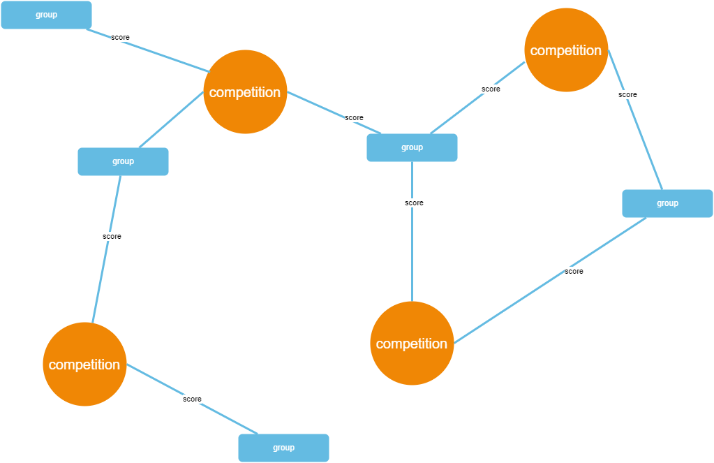

# Data Checkpoint

## Project Code

[https://github.com/svilag/SI507-Final](https://github.com/svilag/SI507-Final)

## Data Sources

The HTML data is stored in on [https://wgi.org/](https://wgi.org/). The data included is divided by competition, and includes scores for each group that participated in that competition.

URLs:

```json
[
    "https://wgi.org/percussion/perc-scores-2022/",
    "https://wgi.org/percussion/perc-scores-2020/",
    "https://wgi.org/percussion/2019-perc-scores/",
    "https://wgi.org/percussion/2018-perc-scores/",
    "https://wgi.org/winds/winds-scores-2022/",
    "https://wgi.org/winds/winds-scores-2020/",
    "https://wgi.org/winds/2019-winds-scores/",
    "https://wgi.org/2018-winds-scores/",
    "https://wgi.org/color-guard/2022-scores/",
    "https://wgi.org/color-guard/scores-2020/",
    "https://wgi.org/color-guard/scores-2019/",
    "https://wgi.org/color-guard/scores-2018/"
]
```

Each link in the above list contains about 30-40 links to pages with score data, and about 30-40 links to detailed recap pages. Each url in the list was parsed and the urls for scores and recaps pages grabbed, stored as part of the Competitions class, then those pages were parsed to grab the scores.

The scores pages include a table with performance scores for each group, divided by group class level (example score page: [https://wgi.org/wp-content/uploads/wgi_events/static_scores/2022/scores_San_Bernardino_Perc_Finals.html](https://wgi.org/wp-content/uploads/wgi_events/static_scores/2022/scores_San_Bernardino_Perc_Finals.html)).

The recap pages contain similar data, but in a more complex table with breakdowns by category with the names of judges for each category listed. Theses scores are also divided by group class level (example recaps page: [https://recaps.competitionsuite.com/24c4c8ec-a300-4737-816b-e78dc0a3221c.htm](https://recaps.competitionsuite.com/24c4c8ec-a300-4737-816b-e78dc0a3221c.htm)).

### Records

The JSON for each Competition is written to [./data/competitions.json](./data/competitions.json). The JSON for each Group is written to [./data/groups.json](./data/groups.json).

Competitions: There are 382 competitions.

Each Competition object stores:

- name of the competition
- competition date
- url to the scores page so the scores can be parsed
- url to the recaps so the recaps can be parsed
- list of group names that particpated in the competition
- dictionary of groups and their score for that competition

```json
{
    "title": "competition_name",
    "date": "competition_date",
    "scores": "url_to_scores_page",
    "recap": "url_to_recap_page",
    "groups": ["group_name","..."],
    "scores_by_group": {"group_name": "score"}
}
```

Groups: There are 1509 groups.

Each Group object stores:

- type of group (percussion, winds, color guard): groups of the same type compete against each other
- name of the group
- class level: groups of the same class level are scored with each other
- location the group is from

```json
{
    "group_type": "group_type",
    "name": "group_name",
    "class_level": "class_level",
    "location": "location",
}
```

### Caching

As each url is parsed it is stored in a cache by calling the function `get_from_cache()`.

```python
def get_from_cache(url:str) -> str:
    """checks cache for url, returns html content
    """
    logger.info("Checking cache for: %s", url)
    if url not in CACHE:
        CACHE[url] = get_content(url)
        logger.info("Added page to cache: %s", url)

    write_json('./cache/cache.json', CACHE)

    return CACHE[url]
```

## Data Structure

The data will be stored in a graph. The initial proposal indicated a tree would be used, but upon interacting with the data further, a graph seems more appropriate.

Each vertice in the graph will be either a competition or a group, with the edge between each group and competition being the score the group received for the competition.



## Interaction & Presentation

The data will be presented using a Flask application. The user will presented with a form to input options for data they would like to filter on.
